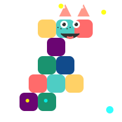

# Dragon Blocks: Reading Adventures



## Overview

**Dragon Blocks: Reading Adventures** is an educational game built with Angular that helps children learn to read by manipulating whole syllable‑blocks to build objects for the friendly dragon, **Toothless**. The child drags blocks, each containing a pre‑written syllable, onto a Lego‑style baseplate to form words. As blocks snap together, Toothless provides audio feedback, encouraging learning through interactive play.

## Game Mechanics

### Workspace

- A large Lego baseplate acts as the workspace.
- At the bottom of the screen is a **bin** containing syllable blocks (e.g., **MA**, **LO**, **BA**, **KA**).
- Children use the mouse (or touch) to grab a block and attach it to other blocks on the plate.

### Difficulty Levels (Hint Mechanics)

| Level                                                         | Name                                      | Hint Type                                                                                       | Description                                                                                                                                                                                                       |
| ------------------------------------------------------------- | ----------------------------------------- | ----------------------------------------------------------------------------------------------- | ----------------------------------------------------------------------------------------------------------------------------------------------------------------------------------------------------------------- |
|  | **Level 1 – Master’s Blueprint** (Guided) | Semi‑transparent ghost blocks on the plate showing the needed syllables (e.g., **CA**, **KE**). | Children simply find the matching blocks and overlay them on the hints. Toothless voices each syllable and then the whole word when the blocks match.                                                             |
|    | **Level 2 – Secret Model** (No Hints)     | Only an image (e.g., a Lego fish) is shown; no text guide.                                      | Children independently locate the correct syllables (**FI**, **SH**) from the bin and connect them in order. Correct assembly triggers Toothless to celebrate and transforms the blocks into the depicted object. |

### Word Progression

1. **Double Stage** – Words made of identical syllables (e.g., **MA‑MA**, **PA‑PA**, **BA‑BA**).
2. **Simple Objects Stage** – Simple object names using open syllables (e.g., **PI‑ZZA**, **SO‑FA**, **LA‑VA**, **RO‑BOT**).
3. **Isle of Berk Stage** – More complex words (e.g., **WA‑TER**, **MO‑NEY**, **TI‑GER**, **PU‑MA**).

## Features for Stress‑Free Exploration

- **Audio Hint** – Clicking a syllable in the bin makes Toothless voice it briefly, helping children listen to the options before choosing.
- **Gentle Failure** – Incorrect assemblies (e.g., **BA‑FI** instead of **FI‑SH**) cause Toothless to tilt his head comically, read the created word, and allow the child to try again.
- **Visual Rewards** – Each correctly assembled model stays on the field, gradually building a Lego city.
- **Accessibility** – The app is built to pass AXE checks and follows WCAG AA guidelines (focus management, color contrast, ARIA attributes).

## Getting Started

### Prerequisites

- **Node.js** (v20+ recommended)
- **pnpm** package manager
- **Angular CLI** installed globally (`pnpm install -g @angular/cli`)

### Installation

```bash
# Clone the repository
git clone <repository-url>
cd angular-dragon-blocks

# Install dependencies
pnpm install
```

### Development Server

```bash
pnpm ng serve
```

Open your browser and navigate to `http://localhost:4200/`. The app will automatically reload when you modify source files.

### Building for Production

```bash
pnpm ng build
```

The production build artifacts are output to the `dist/` directory.

### Running Tests

```bash
# Unit tests (Vitest)
pnpm ng test

# End‑to‑end tests (choose a framework)
pnpm ng e2e
```

## Development Guidelines (Angular v20+)

- **Standalone Components** – Use standalone components instead of NgModules.
- **Signal‑Based State** – Manage component state with Angular signals (`signal`, `computed`).
- **OnPush Change Detection** – Set `changeDetection: ChangeDetectionStrategy.OnPush` for performant UI updates.
- **Avoid Host Decorators** – Use the `host` object in the component metadata instead of `@HostBinding`/`@HostListener`.
- **Use NgOptimizedImage** – For static images (no base64 inline images).
- **Accessibility First** – Ensure all UI elements meet WCAG AA; use the `@angular/cdk/a11y` utilities where helpful.
- **Coding Style** – Prefer inline templates for small components, employ reactive forms, and use class/style bindings instead of `ngClass` / `ngStyle`.

## Contributing

Contributions are welcome! Please follow these steps:

1. Fork the repository.
2. Create a feature branch (`git checkout -b feat/your-feature`).
3. Make your changes, ensuring they pass linting and AXE accessibility checks.
4. Run tests (`pnpm ng test`).
5. Submit a pull request describing your changes.

## License

This project is licensed under the **GNU General Public License v3.0** (GPL‑3.0). See [LICENCE.md](./LICENCE.md) for details.

---

_Take a step into the world of syllable blocks, help Toothless build, and watch reading skills take flight!_
